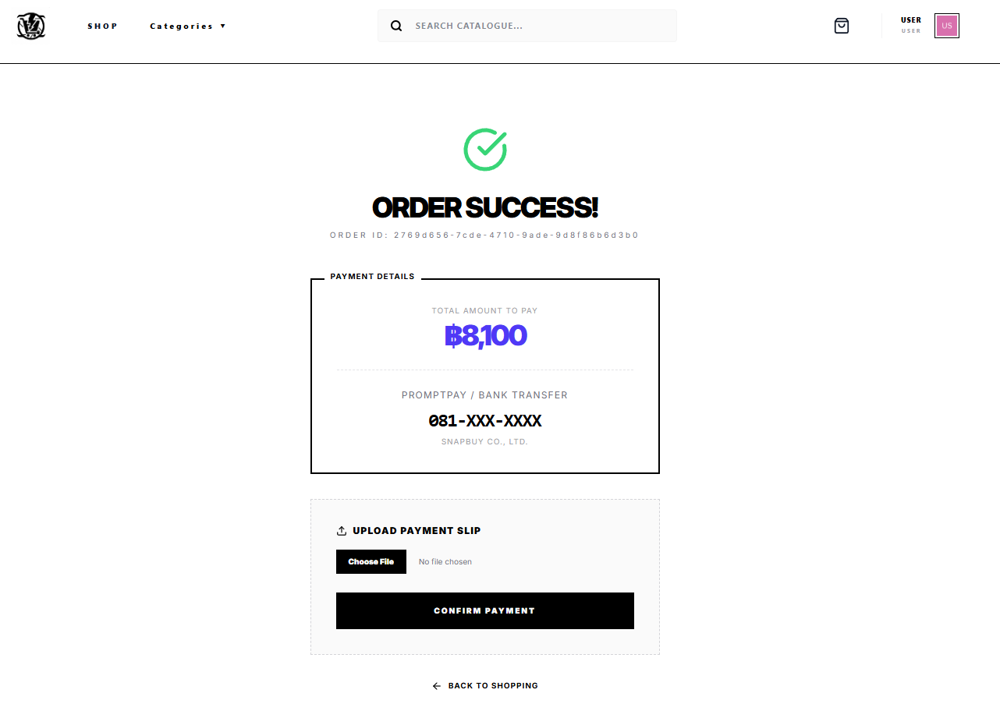
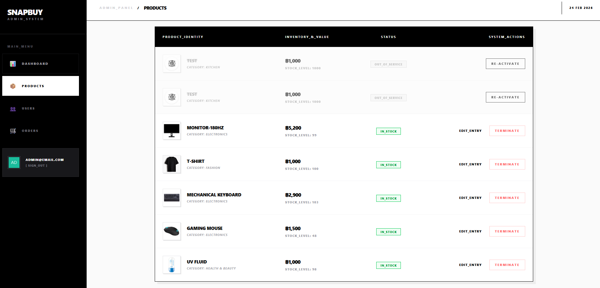
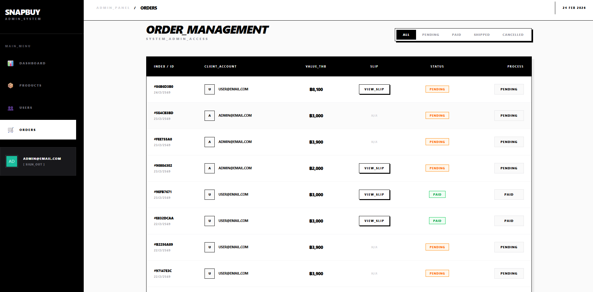

---

# 🚀 SnapBuy – Fullstack E-Commerce Web Application

**SnapBuy** คือโปรเจกต์ E-Commerce แบบ Fullstack ที่ออกแบบมาเพื่อจำลองระบบขายสินค้าในโลกจริง
ครอบคลุมตั้งแต่ Authentication, Shopping Cart, Order Management ไปจนถึงระบบ Admin หลังบ้าน

โปรเจกต์นี้พัฒนาโดยเน้น **System Flow, Data Integrity และ Real-world Use Case** มากกว่าการทำ UI เพียงอย่างเดียว

---

## 🔗 Live Demo

- **Frontend:** [https://snapbuy-ecommerce.vercel.app/]
- **Backend API:** [https://snapbuy-ecommerce-nqk9.onrender.com]

### 👤 Demo Accounts

```txt
User:
email: user@email.com
password: User123456

Admin:
email: admin@email.com
password: Admin123
```

> 💡 _Admin account ใช้ user เดียวกัน แต่กำหนด role = ADMIN ใน database_

---

## ✨ Key Features

### 🔐 Authentication & Authorization

- Login / Logout ผ่าน Auth0
- JWT verification ฝั่ง Backend
- Role-based access control (USER / ADMIN)

### 🛍 Product & Catalog

- แสดงรายการสินค้า
- Filter ตามหมวดหมู่
- Search สินค้า (Backend query optimized)
- Product detail page

### 🛒 Shopping Cart

- เพิ่ม / ลดจำนวนสินค้า
- คำนวณราคารวมแบบ Real-time
- จัดการ state ด้วย Zustand
- Persist cart เมื่อ refresh หน้าเว็บ

### 📦 Order System

- สร้าง Order จากตะกร้าสินค้า
- จัดการสถานะ Order (PENDING / PAID / COMPLETED)
- User ดูประวัติการสั่งซื้อได้

### 💳 Payment Evidence (Manual Verification)

- แสดงยอดที่ต้องชำระ
- อัปโหลดสลิปการโอนเงิน
- Admin ตรวจสอบและอนุมัติคำสั่งซื้อ

### 🧑‍💼 Admin Panel

- เพิ่ม / แก้ไข / ลบสินค้า
- อัปโหลดรูปสินค้า
- ดูรายการคำสั่งซื้อทั้งหมด
- อัปเดตสถานะ Order

### 🖼 Image Management

- จัดเก็บรูปสินค้าและสลิปผ่าน Cloudinary
- รองรับ image optimization อัตโนมัติ

---

## 🔄 System Flow (High-Level)

1. ผู้ใช้ Login ผ่าน Auth0
2. Frontend ขอ Access Token
3. Backend verify JWT และ sync user เข้า database
4. ผู้ใช้เลือกสินค้า → เพิ่มลง Cart
5. Checkout → สร้าง Order (PENDING)
6. ผู้ใช้อัปโหลดหลักฐานการชำระเงิน
7. Admin ตรวจสอบและอัปเดตสถานะ Order

---

## 🏗 Project Architecture

```
SnapBuy
├── frontend   (React + TypeScript + Vite)
├── backend    (Node.js + Express + Prisma)
└── database   (PostgreSQL)
```

- **Frontend:** Deploy บน Vercel
- **Backend:** Deploy บน Render
- **Database:** PostgreSQL (Hosted on Supabase)

---

## 🛠 Tech Stack

### Frontend

- React 19
- TypeScript
- Tailwind CSS v4
- Zustand
- React Router DOM v7
- Auth0 React SDK

### Backend

- Node.js
- Express 5
- Prisma ORM
- PostgreSQL
- Auth0 JWT Bearer Middleware
- Cloudinary + Multer

---

## 🗄 Database Schema (Simplified)

- **User**
  - auth0Id
  - email
  - role (USER / ADMIN)

- **Product**
  - name
  - price
  - category
  - imageUrl

- **Order**
  - userId
  - totalPrice
  - status

- **OrderItem**
  - orderId
  - productId
  - quantity
  - price

---

## 🤔 Why This Tech Stack?

- **Auth0** – ลดความซับซ้อนด้าน Security และ Authentication Flow
- **Prisma ORM** – Type-safe database access ลด runtime error
- **Zustand** – Lightweight state management เหมาะกับ cart logic
- **Cloudinary** – จัดการ image upload และ optimization ได้ง่าย
- **PostgreSQL** – รองรับ relational data ที่ซับซ้อนในระบบ e-commerce

---

## 🖼 Screenshots

>




- **Admin Dashboard**




---

## 📦 Local Development

### Frontend

```bash
npm install
npm run dev
```

### Backend

```bash
npm install
npx prisma migrate dev
npm run dev
```

---

## 📌 Notes

- ระบบชำระเงินในโปรเจกต์นี้เป็น **Manual Verification**
- ออกแบบเพื่อโฟกัสที่ **Order Flow และ Admin Management**
- พร้อมขยายต่อเป็น Credit Card / Payment Gateway ได้ในอนาคต

---

## 👨‍💻 Author

**Computer Science Graduate**
สนใจงานด้าน **Full-stack / Backend Development**

---
